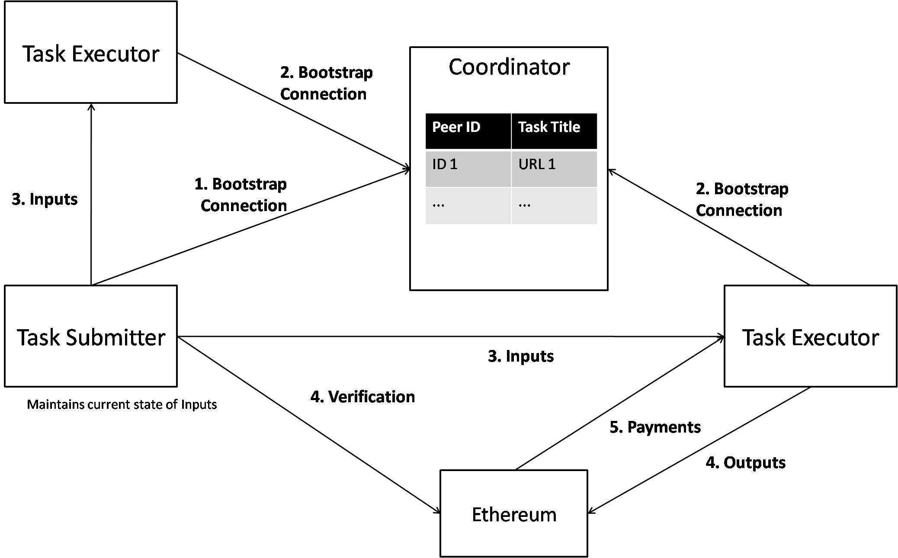

# ColabIt - A Web Based, Incentivised volunteer computing platform

## Architecture



## Running the Code

(Node.js version `v8.9.3`. npm verison `5.5.1`)

Clone the repo :
```
git clone https://github.com/SagarB-97/ColabIt.git
cd ColabIt
```

### Run the peer server

1. Install dependencies
```
cd peerserver
npm install
```

2. Run server
```
node index.js
```

### Run the coordinator

Run the following in the repository's root

1. Install dependencies :
```
npm install
```

2. Start the application :
```
npm start
```

## Using the platform

### Task Submitter

The platform can be used to distribute tasks that require enormous number of CPU cycles. The task can be distributed such that each executor (or volunteer) performs the task task in parallel and returns the calculated output to the submitter (until the incentivisation layer is integrated).

1. Open browser and go to `http://localhost:3000/` and choose `Submit Task`

2. Enter Task title and the javascript function (See below).

3. Hit Submit. A peer is registered and it starts waiting for executors to connect to it.

4. Enter batch size and Input. Input format is :
```json
{
  "Input": [/*Your array of input JSONs*/]
}
```

### Writing Javascript Function

This is the function that each executor executes in parallel. The submitter divides the entire input into smaller arrays of `Batch Size` each and each executor is sent its share of input. <br>

**Assumption** : Assume the variable `input` contains the json object that the executor receives.

The plaform takes care of : <br>
1. Scaling up as the number of executors connected increases. That is, the throughput is proportional to the number of connected executors.
2. Giving an executor more input as soon as it signals completion of its allotted batch. This way the more competent executors (with higher computational power) can contribute more.

## Example

An example problem that the platform can be used to solve is **Factorisation of a large number**.

The javascript function for this problem is :

```javascript
obj = input;
factor = [];
outArr = [];
for(var k = obj.start; k <= obj.end && k * k <= obj.num; k++) {
	if(obj.num % k == 0) {
		factor.push(k);
		factor.push(obj.num / k);
	}
}
outArr.push({Factor: factor});
return {output: outArr};
```

The input to find factors of `123456789123456800000` can be :
```json
{
  "Input": [
    {
      "start": 1,
      "end": 100000000,
      "num": 123456789123456800000
    },
    {
      "start": 100000001,
      "end": 200000000,
      "num": 123456789123456800000
    },
    ...
    ...
    ...
    {
      "start": 11100000001,
      "end": 11200000000,
      "num": 123456789123456800000
    }
  ]
}
```

The entire input and a script to generate the input is provided in the `Examples` folder.