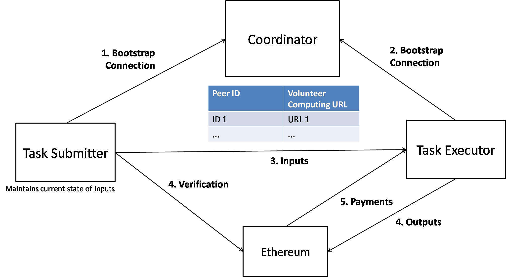

# ColabIt - A Web Based, Incentivised volunteer computing platform

## Architecture



## Running the Code

(Node.js version `v8.9.3`. npm verison `5.5.1`)

1. Clone the repo :
```
git clone https://github.com/SagarB-97/ColabIt.git
cd ColabIt
```

2. Install dependencies :
```
npm install
```

3. Start the application :
```
npm start
```

